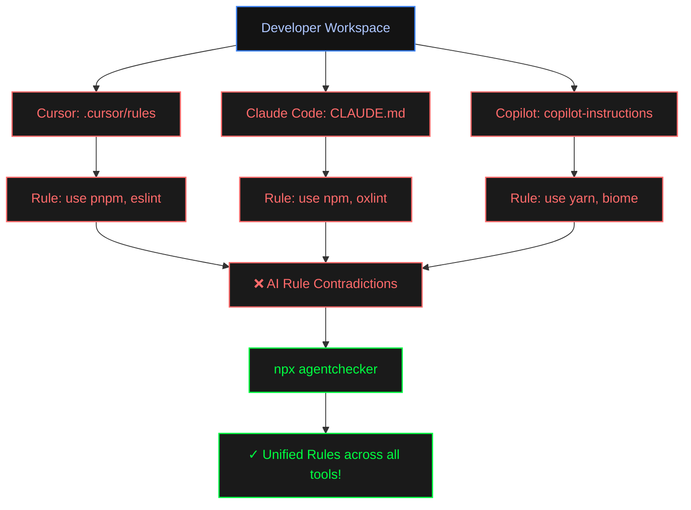
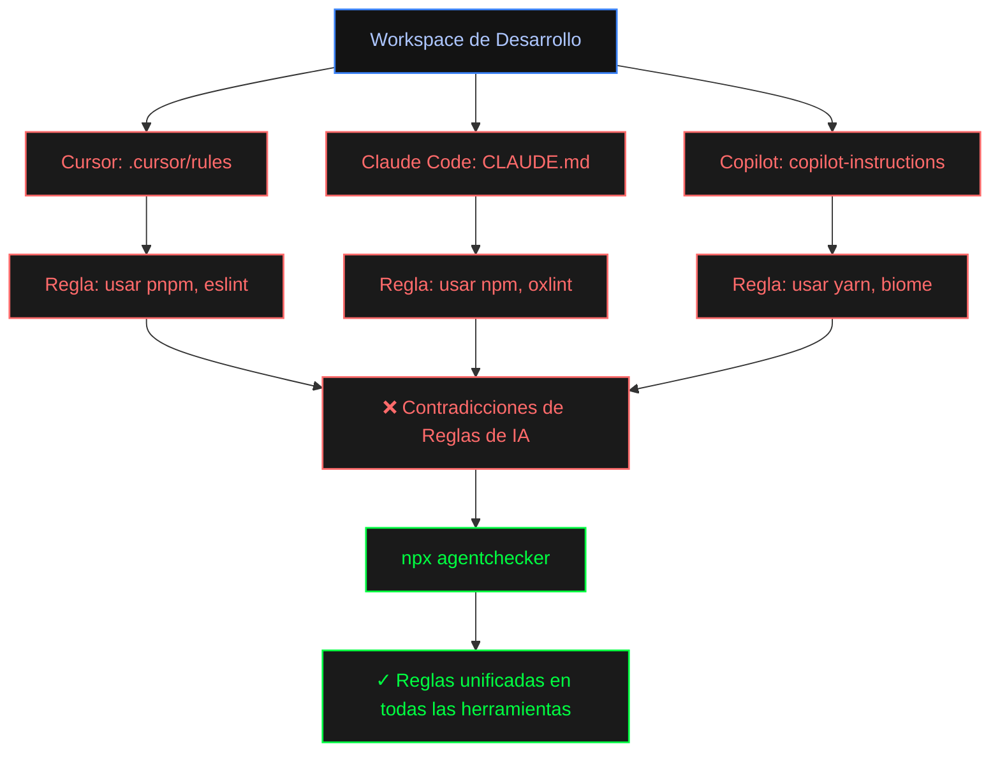

# agentchecker 🔍🤖

<p align="center">
  <strong>One command. All your AI agents agree.</strong><br>
  <em>Un solo comando. Todos tus agentes de IA alineados.</em>
</p>

<p align="center">
  <a href="https://www.npmjs.com/package/agentchecker"></a>
  <a href="https://github.com/moisesvalero/agentchecker/blob/main/LICENSE"></a>
  
  
</p>

---

<p align="center">
  <a href="#-english">English</a> • 
  <a href="#-español">Español</a>
</p>

---

<a id="-english"></a>

## 🇬🇧 English

### ⚡ The Problem: The "Rule Drift"

When you pair program with multiple AI coding tools, each one reads a different instructions or rules file in your repository:
* **Cursor** reads `.cursorrules` or `.cursor/rules/*.mdc`
* **Claude Code** reads `CLAUDE.md` or `.claude/CLAUDE.md`
* **GitHub Copilot** reads `.github/copilot-instructions.md`
* **Humans & Shared Agents** read `AGENTS.md`

Over time, these rules drift apart. Cursor starts using `pnpm` and `eslint`, Claude defaults to `npm` and `oxlint`, and Copilot reformats everything with `biome`. **The result? Conflicted generation, compilation errors, and wasted API tokens.**



### ✨ The Solution

`agentchecker` is a zero-dependency, ultra-fast CLI tool that:
1. **Scans** your project for all agent instructions files in milliseconds.
2. **Extracts & parses** tech stack decisions (package managers, linters, formatters, test runners).
3. **Highlights contradictions** using a clean, terminal-based diagnostic report.
4. **Fixes them interactively** by applying safe, localized inline updates so all your agents agree.

---

### 🚀 Quick Start

No installation required. Run it directly in the root of your project:

```bash
npx agentchecker
```

---

### 🛠️ Professional Workflow Integration

To get the most out of `agentchecker` and guarantee that your rules never drift again, integrate it into your daily workflow:

#### 1. Pre-commit Hook (Husky)
Prevent committing conflicting instructions. Add this to your `.husky/pre-commit` or Git hooks runner:

```bash
npx agentchecker --check-only
```
*It will scan files and exit with code `1` if any contradiction exists, halting the commit.*

#### 2. CI/CD Pipeline (GitHub Actions)
Ensure team pull requests don't introduce conflicting rules. Create `.github/workflows/agent-check.yml`:

```yaml
name: AI Agent Rules Check
on: [push, pull_request]

jobs:
  audit:
    runs-on: ubuntu-latest
    steps:
      - uses: actions/checkout@v4
      - name: Install Node.js
        uses: actions/setup-node@v4
        with:
          node-version: 20
      - name: Run agentchecker
        run: npx agentchecker --check-only
```

---

### 📋 Supported Tools & Instruction Files

`agentchecker` unifies the configurations of the industry's most popular AI coding assistants, editors, and agents:

| AI Program / Agent | Project-Level Rules | Global / User Rules | Format |
| :--- | :--- | :--- | :--- |
| **Cursor** | `.cursorrules`, `.cursor/rules/*.mdc` | *Sidebar settings / Profiles* | Markdown / MDC |
| **Claude Code** | `CLAUDE.md`, `.claude/CLAUDE.md` | `~/.claude/CLAUDE.md` | Markdown |
| **GitHub Copilot** | `.github/copilot-instructions.md`, `.github/instructions/*.instructions.md` | *Copilot global settings* | Markdown |
| **Codex App** | `AGENTS.md`, `.codex/config.toml` | `~/.codex/AGENTS.md`, `~/.codex/config.toml` | Markdown / TOML |
| **Antigravity 2.0** | `.agents/AGENTS.md`, `.agents/skills/*/SKILL.md` | `~/.gemini/config/AGENTS.md` | Markdown |
| **OpenCode** | `AGENTS.md`, `.opencode.json` | `~/.config/opencode/AGENTS.md`, `~/.config/opencode/opencode.json` | Markdown / JSON |
| **Windsurf** | `.windsurfrules`, `.windsurf/rules/` | *Cascade Sidebar custom rules* | Markdown |
| **Roo Cline (Roo Code / Cline)** | `.clinerules`, `.clinerules/`, `.roo/rules/` | `.clinerules-<mode>` | Markdown |
| **Aider** | `CONVENTIONS.md`, `.aider.conf.yml` | `~/.aider.conf.yml` | Markdown / YAML |

#### Analyzed Tooling Categories
* 📦 **Package Managers**: `pnpm`, `npm`, `yarn`, `bun`
* ⚡ **Linters**: `oxlint`, `eslint`, `biome`
* 🎨 **Formatters**: `prettier`, `biome`, `dprint`
* 🧪 **Test Runners**: `vitest`, `jest`, `playwright`

---

### ⚙️ Command Line Options

```bash
agentchecker — fix contradictions between AI agent instruction files

Usage:
  npx agentchecker [options]

Options:
  --dry-run       Show contradictions and preview without writing
  --check-only    Exit 1 if contradictions exist (CI mode)
  -y, --yes       Apply recommended fixes without prompts
  -a, --agent     Limit scan to agents: cursor, claude, copilot, shared
  --project-dir   Project directory to scan (default: cwd)
  -v, --verbose   Verbose output
  -h, --help      Show help
```

---

### 💻 Local Development

```bash
# Clone the repository
git clone https://github.com/moisesvalero/agentchecker.git
cd agentchecker

# Install monorepo dependencies
pnpm install

# Run all test suites (Unit + E2E)
pnpm --filter agentchecker test

# Build the CLI
pnpm --filter agentchecker build

# Run the Svelte dev server for the landing page
pnpm --filter @agentchecker/web dev
```

---
---

<a id="-español"></a>

## 🇪🇸 Español

### ⚡ El Problema: La desviación de reglas (Rule Drift)

Cuando programas en pareja con varias herramientas de IA al mismo tiempo, cada una de ellas lee un archivo de configuración e instrucciones diferente en tu repositorio:
* **Cursor** lee `.cursorrules` o `.cursor/rules/*.mdc`
* **Claude Code** lee `CLAUDE.md` o `.claude/CLAUDE.md`
* **GitHub Copilot** lee `.github/copilot-instructions.md`
* **Humanos y Agentes Compartidos** leemos `AGENTS.md`

Con el tiempo, estas reglas inevitablemente divergen. Cursor empezará a usar `pnpm` y `eslint`, Claude asumirá por defecto `npm` y `oxlint`, y Copilot reformateará el código usando `biome`. **¿El resultado? Comportamiento errático de los agentes, errores de compilación y pérdida innecesaria de tokens de API.**



### ✨ La Solución

`agentchecker` es una herramienta CLI extremadamente rápida y sin dependencias externas que:
1. **Escanea** tu proyecto buscando archivos de instrucciones en milisegundos.
2. **Extrae y parsea** las tecnologías definidas (gestores de paquetes, linters, formateadores, test runners).
3. **Muestra las contradicciones** en un reporte de diagnóstico limpio directamente en tu terminal.
4. **Las soluciona de forma interactiva** aplicando cambios seguros en el propio archivo para que todas tus IAs estén alineadas.

---

### 🚀 Inicio Rápido

No requiere instalación. Ejecútalo directamente en la raíz de tu proyecto:

```bash
npx agentchecker
```

---

### 🛠️ Integración en tu Flujo Diario de Trabajo

Para maximizar el valor de `agentchecker` y asegurar que tus reglas nunca se vuelvan a desviar, intégralo en tus herramientas habituales:

#### 1. Git Hook Pre-commit (Husky)
Evita subir instrucciones conflictivas al repositorio. Añade esto a tu `.husky/pre-commit` o tu gestor de hooks de Git:

```bash
npx agentchecker --check-only
```
*Si se detecta una contradicción, la herramienta saldrá con código `1` y detendrá el commit automáticamente.*

#### 2. Pipeline de Integración Continua (GitHub Actions)
Garantiza que ningún pull request introduzca reglas conflictivas. Crea el archivo `.github/workflows/agent-check.yml`:

```yaml
name: AI Agent Rules Check
on: [push, pull_request]

jobs:
  audit:
    runs-on: ubuntu-latest
    steps:
      - uses: actions/checkout@v4
      - name: Install Node.js
        uses: actions/setup-node@v4
        with:
          node-version: 20
      - name: Run agentchecker
        run: npx agentchecker --check-only
```

---

### 📋 Herramientas y Archivos Soportados

`agentchecker` unifica las configuraciones de los asistentes de código de IA, editores y agentes más populares de la industria:

| Programa / Agente de IA | Reglas a Nivel de Proyecto | Reglas Globales / de Usuario | Formato |
| :--- | :--- | :--- | :--- |
| **Cursor** | `.cursorrules`, `.cursor/rules/*.mdc` | *Ajustes de barra lateral / Perfiles* | Markdown / MDC |
| **Claude Code** | `CLAUDE.md`, `.claude/CLAUDE.md` | `~/.claude/CLAUDE.md` | Markdown |
| **GitHub Copilot** | `.github/copilot-instructions.md`, `.github/instructions/*.instructions.md` | *Ajustes globales de Copilot* | Markdown |
| **Codex App** | `AGENTS.md`, `.codex/config.toml` | `~/.codex/AGENTS.md`, `~/.codex/config.toml` | Markdown / TOML |
| **Antigravity 2.0** | `.agents/AGENTS.md`, `.agents/skills/*/SKILL.md` | `~/.gemini/config/AGENTS.md` | Markdown |
| **OpenCode** | `AGENTS.md`, `.opencode.json` | `~/.config/opencode/AGENTS.md`, `~/.config/opencode/opencode.json` | Markdown / JSON |
| **Windsurf** | `.windsurfrules`, `.windsurf/rules/` | *Reglas personalizadas de Cascade* | Markdown |
| **Roo Cline (Roo Code / Cline)** | `.clinerules`, `.clinerules/`, `.roo/rules/` | `.clinerules-<mode>` | Markdown |
| **Aider** | `CONVENTIONS.md`, `.aider.conf.yml` | `~/.aider.conf.yml` | Markdown / YAML |

#### Categorías Analizadas
* 📦 **Gestores de paquetes**: `pnpm`, `npm`, `yarn`, `bun`
* ⚡ **Linters**: `oxlint`, `eslint`, `biome`
* 🎨 **Formateadores**: `prettier`, `biome`, `dprint`
* 🧪 **Test Runners**: `vitest`, `jest`, `playwright`

---

### ⚙️ Parámetros de Consola (Flags)

```bash
agentchecker — fix contradictions between AI agent instruction files

Uso:
  npx agentchecker [opciones]

Opciones:
  --dry-run       Muestra contradicciones y previsualiza cambios sin escribir
  --check-only    Sale con código 1 si existen contradicciones (modo CI)
  -y, --yes       Aplica las soluciones recomendadas de forma automática
  -a, --agent     Limita el análisis a: cursor, claude, copilot, shared
  --project-dir   Directorio a escanear (por defecto: cwd)
  -v, --verbose   Salida detallada (modo debug)
  -h, --help      Muestra la ayuda
```

---

### 💻 Desarrollo Local

```bash
# Clonar el repositorio
git clone https://github.com/moisesvalero/agentchecker.git
cd agentchecker

# Instalar dependencias del monorepo
pnpm install

# Ejecutar la suite de tests (Unitarios + E2E)
pnpm --filter agentchecker test

# Compilar la herramienta CLI
pnpm --filter agentchecker build

# Iniciar el servidor Svelte local para la landing page
pnpm --filter @agentchecker/web dev
```

---

## License / Licencia

MIT
