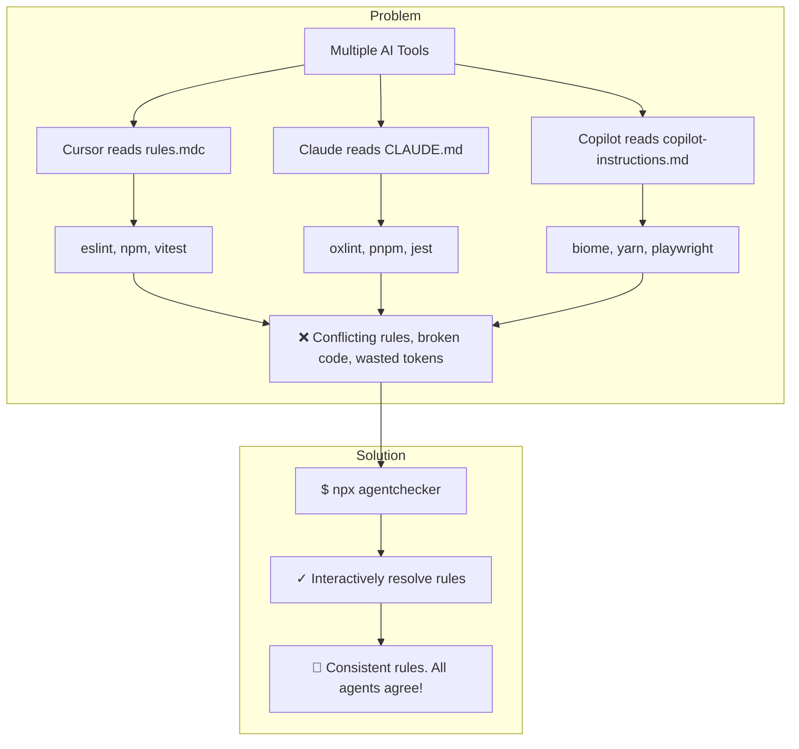
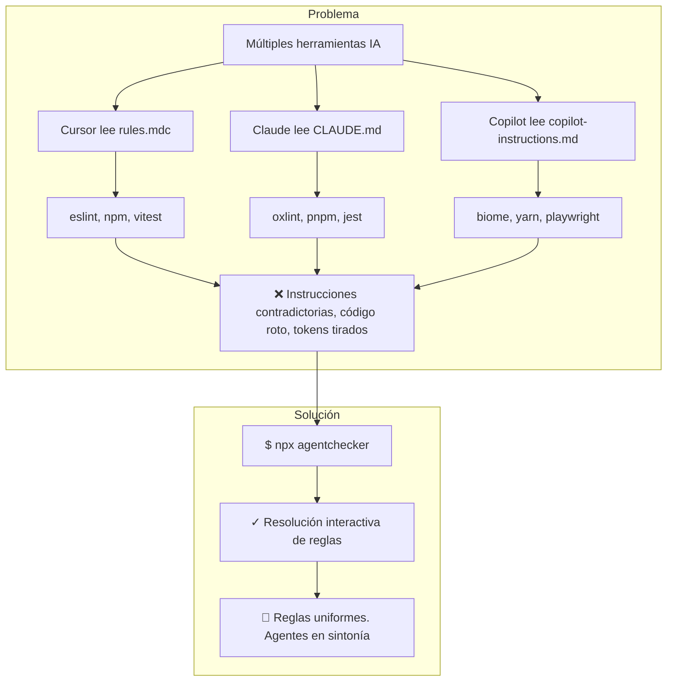

# agentchecker 🔍🤖

> **One command. All your AI agents agree.**  
> **Un solo comando. Todos tus agentes de IA alineados.**

---

<p align="center">
  <a href="#english">English 🇬🇧</a> • 
  <a href="#español">Español 🇪🇸</a>
</p>

---

<a id="english"></a>

## English Version

`agentchecker` is a zero-dependency CLI tool that scans your codebase for agent instruction files (Cursor, Claude Code, Copilot, etc.), detects logical contradictions in your rules, and helps you fix them interactively in 2 seconds.



### Why do you need it?

When working with multiple AI coding tools, each tool reads a different instruction file:
* **Cursor**: `.cursorrules`, `.cursor/rules/*.mdc`
* **Claude Code**: `CLAUDE.md`, `.claude/CLAUDE.md`
* **GitHub Copilot**: `.github/copilot-instructions.md`, `.github/instructions/*.instructions.md`
* **Shared Rules**: `AGENTS.md`

Without synchronization, rules slowly drift apart. Cursor runs `pnpm`, Claude runs `npm`, and Copilot formats with `eslint` instead of `oxlint`. `agentchecker` fixes this drift instantly.

---

### Quick Start

Run the auditor directly in your project root:

```bash
npx agentchecker
```

#### What it does:
1. **Scans** your project for agent instruction files.
2. **Detects** objective contradictions (e.g. package manager, linters, test runners).
3. **Prompts** you to select your preferred choice.
4. **Applies** safe, precise inline fixes to all files.

---

### Live Example

```bash
$ npx agentchecker

┌  agentchecker
│
◇  Found:
   ✓ AGENTS.md (Shared)
   ✓ CLAUDE.md (Claude Code)
   ✓ .cursor/rules/global.mdc (Cursor)
│
⚠ 2 contradictions found
│
? Fix contradictions? Yes
? Package manager › pnpm (recommended)
? Linter › oxlint
│
✓ Fixed 2 files. All your agents agree.
└  Done in 0.4s
```

---

### Command Flags & Options

| Flag | Description |
| --- | --- |
| `--dry-run` | Preview contradictions and changes without writing to files |
| `--check-only` | CI mode: exits with status code `1` if contradictions are found |
| `-y, --yes` | Automatically apply all recommended fixes without prompt |
| `-a, --agent` | Limit the scan to specific agents (e.g., `cursor`, `claude`, `copilot`, `shared`) |
| `--project-dir` | Scan a specific directory instead of the current working directory |
| `-h, --help` | Show the help menu |

---

### Checks Supported (v0.1)

* 📦 **Package manager**: `pnpm` | `npm` | `yarn` | `bun`
* ⚡ **Linter**: `oxlint` | `eslint` | `biome`
* 🎨 **Formatter**: `prettier` | `biome` | `dprint`
* 🧪 **Test runner**: `vitest` | `jest` | `playwright`

---

### Local Development

To run the project locally or contribute:

```bash
# Install workspace dependencies
pnpm install

# Run unit and E2E tests
pnpm --filter agentchecker test

# Build the CLI
pnpm --filter agentchecker build

# Run the Svelte dev server for the landing page
pnpm --filter @agentchecker/web dev
```

---
---

<a id="español"></a>

## Versión en Español

`agentchecker` es una herramienta CLI sin dependencias externas que escanea tu repositorio en busca de archivos de instrucciones para agentes de IA (Cursor, Claude Code, Copilot, etc.), detecta contradicciones lógicas en las reglas y te ayuda a resolverlas interactivamente en 2 segundos.



### ¿Por qué lo necesitas?

Cuando utilizas múltiples herramientas de desarrollo asistido por IA, cada una lee un archivo de instrucciones diferente:
* **Cursor**: `.cursorrules`, `.cursor/rules/*.mdc`
* **Claude Code**: `CLAUDE.md`, `.claude/CLAUDE.md`
* **GitHub Copilot**: `.github/copilot-instructions.md`, `.github/instructions/*.instructions.md`
* **Reglas compartidas**: `AGENTS.md`

Con el tiempo, estas reglas divergen de forma inevitable. Cursor ejecutará `pnpm`, Claude intentará instalar dependencias con `npm`, y Copilot usará `eslint` en lugar de `oxlint`. `agentchecker` unifica y corrige este desfase al instante.

---

### Inicio Rápido

Ejecuta el auditor directamente en la raíz de tu proyecto:

```bash
npx agentchecker
```

#### ¿Qué hace exactamente?
1. **Escanea** el proyecto identificando todos los archivos de instrucciones de agentes.
2. **Detecta** contradicciones de forma estática (ej. gestores de paquetes, linters, formateadores).
3. **Pregunta** interactivamente qué herramientas prefieres mantener.
4. **Aplica** modificaciones seguras in-situ en todos los archivos markdown para alinearlos.

---

### Ejemplo de Uso

```bash
$ npx agentchecker

┌  agentchecker
│
◇  Found:
   ✓ AGENTS.md (Shared)
   ✓ CLAUDE.md (Claude Code)
   ✓ .cursor/rules/global.mdc (Cursor)
│
⚠ 2 contradicciones encontradas
│
? Fix contradictions? Yes
? Package manager › pnpm (recommended)
? Linter › oxlint
│
✓ Fixed 2 files. All your agents agree.
└  Done in 0.4s
```

---

### Opciones y Parámetros (Flags)

| Opción | Descripción |
| --- | --- |
| `--dry-run` | Muestra las contradicciones y previsualiza los cambios sin escribir en disco |
| `--check-only` | Modo de Integración Continua (CI): sale con código `1` si hay contradicciones |
| `-y, --yes` | Aplica todas las soluciones recomendadas automáticamente sin preguntar |
| `-a, --agent` | Limita el análisis a herramientas específicas (ej. `cursor`, `claude`, `copilot`, `shared`) |
| `--project-dir` | Escanea un directorio de proyecto específico en lugar del actual (CWD) |
| `-h, --help` | Muestra el menú de ayuda |

---

### Reglas Soportadas (v0.1)

* 📦 **Gestor de paquetes**: `pnpm` | `npm` | `yarn` | `bun`
* ⚡ **Linter**: `oxlint` | `eslint` | `biome`
* 🎨 **Formateador**: `prettier` | `biome` | `dprint`
* 🧪 **Framework de pruebas**: `vitest` | `jest` | `playwright`

---

### Desarrollo Local

Si deseas probar la herramienta localmente o contribuir al código:

```bash
# Instalar dependencias del monorepo
pnpm install

# Correr los tests unitarios y E2E
pnpm --filter agentchecker test

# Compilar la herramienta CLI
pnpm --filter agentchecker build

# Iniciar el servidor local Svelte para la landing page
pnpm --filter @agentchecker/web dev
```

---

## License / Licencia

MIT
