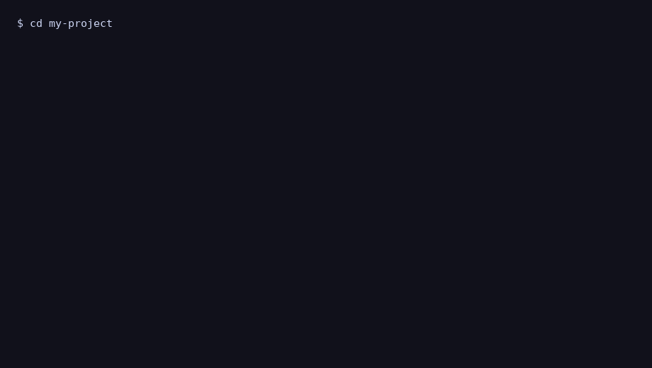

# agentchecker

**One command. All your agents agree.**

`agentchecker` finds contradictions between AI agent instruction files in your repository and fixes them interactively.

```bash
npx agentchecker
```



## Problem

When you use multiple AI coding tools, each one may read a different instruction file:

- `AGENTS.md`
- `CLAUDE.md`
- `.cursor/rules/*.mdc`
- `.github/copilot-instructions.md`

They slowly drift apart. Cursor says `pnpm`, Claude says `npm`, Copilot says `eslint`.

## Solution

Run one command:

```bash
npx agentchecker
```

It will:

1. Scan your project for agent instruction files
2. Detect objective contradictions
3. Ask what you prefer
4. Apply safe fixes with preview

## Example

```bash
$ npx agentchecker

Found:
  ✓ AGENTS.md
  ✓ CLAUDE.md
  ✓ .cursor/rules/global.mdc

⚠ 2 contradictions found

? Fix contradictions? Yes
? Package manager › pnpm (recommended)
? Linter › oxlint

✓ Fixed 2 files. All your agents agree.
```

## Options

| Flag | Description |
| --- | --- |
| `--dry-run` | Preview changes without writing |
| `--check-only` | CI mode, exit `1` if contradictions exist |
| `-y, --yes` | Apply recommended fixes automatically |
| `-a, --agent` | Limit scan to `cursor`, `claude`, `copilot`, `shared` |
| `--project-dir` | Scan a specific directory |

## Supported files (v0.1)

- `AGENTS.md`
- `CLAUDE.md`
- `.claude/CLAUDE.md`
- `.cursor/rules/*.mdc`
- `.cursorrules`
- `.github/copilot-instructions.md`
- `.github/instructions/*.instructions.md`

## Checks (v0.1)

- Package manager: `pnpm`, `npm`, `yarn`, `bun`
- Linter: `oxlint`, `eslint`, `biome`
- Formatter: `prettier`, `biome`, `dprint`
- Test runner: `vitest`, `jest`

## Development

```bash
pnpm install
pnpm --filter agentchecker test
pnpm --filter agentchecker build
pnpm --filter @agentchecker/web dev
```

## Landing

Deployed from GitHub via Vercel (project: `agentchecker`).

## Links

- npm: https://www.npmjs.com/package/agentchecker
- GitHub: https://github.com/moisesvalero/agentchecker

## License

MIT
